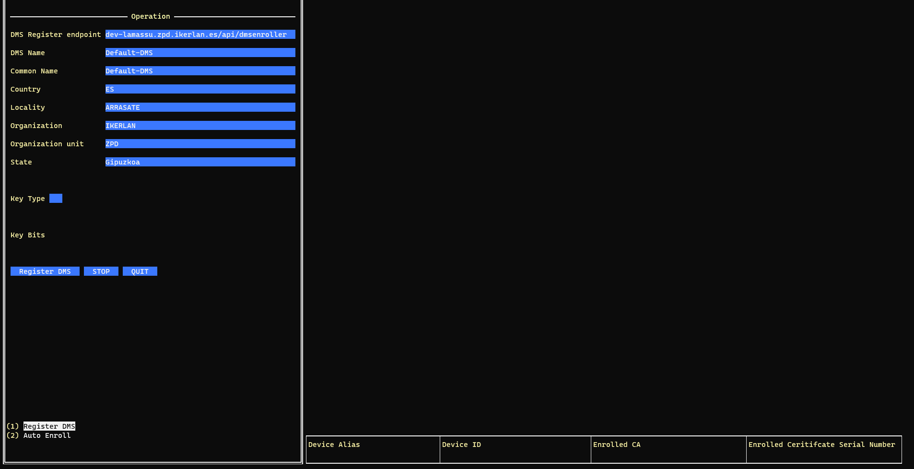
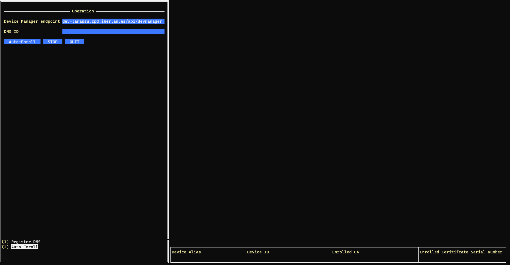

<a href="https://www.lamassu.io/">
    
</a>

Lamassu IoT Virtual DMS
=======
[](http://www.mozilla.org/MPL/2.0/index.txt)

[Lamassu IoT](https://www.lamassu.io) project is a Public Key Infrastructure (PKI) for the Internet of Things (IoT).

To launch Lamassu-Virtual-DMS follow the next steps:

1. Clone the repository and get into the directory: `https://github.com/lamassuiot/lamassu-virtual-dms.git && cd lamassu-virtual-dms`.
2. Change the configuration variables of the `config.json` file.

```
{   
    "domain": "<DOMAIN>",
    "dms": {
        "device_store": "<DEVICES_STORE>", // Folder where device certificates are stored
        "dms_store": "<DMS_STORE>", // Folder where DMS certificates are stored
        "endpoint":"<DMS_SERVER>", // DMS server endpoint
        "dms_name":"<DEFAULT_DMS>", // DMS Name
        "common_name":"<DEFAULT_DMS>", // Common_name to create the CSR
        "country":"<COUNTRY>", // Country to create the CSR
        "locality":"<LOCALITY>", // Locality to create the CSR
        "organization":"<ORGANIZATION>", // Organization to create the CSR
        "organization_unit":"<ORGANIZATION_UNIT>", // Organization_unit to create the CSR
        "state":"<STATE>" // State to create the CSR


    },
    "devmanager":{
        "devcrt": "<DEV_CERTIFICATE>", // Public certificate to connect to the device-manager
        "addr": "<DEVMANAGER_SERVER>" //Device Manager Server Endpoint
    },
    "auth":{
        "endpoint":"<AUTH_SERVER>" // Authentication Server endpoint
    }
}

```
*Common_name and Dms_name have to have the same value
3. Create directories to store DMS and device certificates

    ```
    mkdir -p /home/$USER/virtual-dms-data/devices_certificates
    mkdir -p /home/$USER/virtual-dms-data/dms_certificates
    ```
4. `config.json` file with default values

```
{
    "domain": "dev.lamassu.io",
    "dms": {
        "device_store": "/home/$USER/virtual-dms-data/devices_certificates",
        "dms_store": "/home/$USER/virtual-dms-data/dms_certificates",
        "endpoint":"dev.lamassu.io/api/dmsenroller",
        "dms_name":"Virtual DMS",
        "common_name":"Virtual DMS",
        "country":"ES",
        "locality":"Mondragon",
        "organization":"LKS",
        "organization_unit":"LKS PKI",
        "state":"Guipuzcoa"


    },
    "devmanager":{
        "devcrt": "<DEV_CERTIFICATE>",
        "addr": "dev.lamassu.io/api/devmanager"
    },
    "auth":{
        "endpoint":"auth-dev-lamassu.io"
    }
}

```

5. Run the Lamassu-Default-DMS UI:
    ```
    go run cmd/main.go
    ```
## Lamassu Virtual DMS operating modes
 
In the Lamassu-Virtual-DMS we have two pages:

1. Create the DMS, once the DMS is created, the Auto_Enroll of the devices is done.



2. Make the Auto_Enroll of the devices indicating the ID of a DMS.

